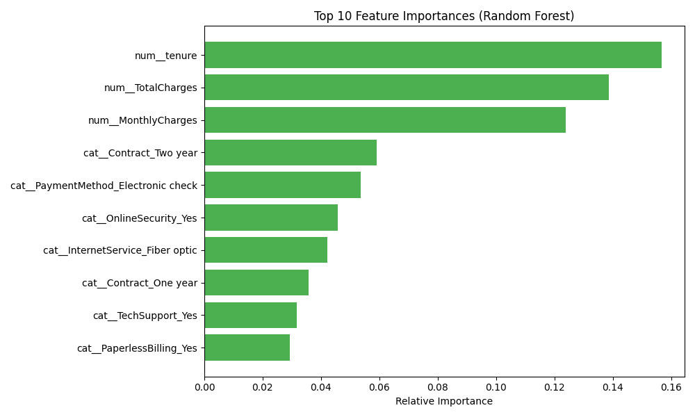

#  Customer Churn Prediction System

##  Problem Statement
Predict whether a customer will leave a company based on their demographic profile, subscribed services, and billing information.

##  Overview
This is an end-to-end Machine Learning project focused on detailed Data Cleaning, Feature Engineering, and Model Training using real-world **Telco Customer Churn** data. We compare Logistic Regression, Random Forest, and XGBoost classifiers to identify the best-performing model, and deploy the final model as an interactive Web Application using **Streamlit**.

##  Business Impact
This model was designed to actively help telecommunication companies:
- **Identify high-risk customers** before they cancel their subscriptions.
- **Take proactive retention actions** by offering targeted discounts or tech support.
- **Reduce revenue loss** by prioritizing customer success resources on users with a high probability of churning.

##  Features & Highlights
* **Robust Feature Engineering**: Leverages `sklearn.compose.ColumnTransformer` to automate `StandardScaler` (for numerical data) and `OneHotEncoder` (for categorical data), ensuring zero data-leakage during train/test splits.
* **Class Balancing**: Integrates `SMOTE` within an `imblearn` pipeline to synthetically boost minority class samples (churners), ensuring the model is not biased towards predicting "No Churn" simply because it's the most common outcome.
* **Interactive UI**: A sleek internal tool built in Streamlit that predicts exact churn probabilities based on live user inputs.

##  Key Insights & Feature Importance
Based on the machine learning model's analysis, we extracted the most important factors that drive a customer to churn:



1. **Contract Type**: Long-term contract users (1 or 2 years) churn significantly less compared to month-to-month users.
2. **Monthly Charges**: Customers with abnormally high monthly charges are far more likely to churn.
3. **Tech Support & Security**: Customers lacking tech support or online security features are at a higher risk of leaving.
##  Project Structure

1. **`train.py`**: The Machine Learning pipeline script.
   - Cleans the raw data.
   - Sets up the Feature Engineering preprocessing steps.
   - Trains Logistic Regression, Random Forest, and XGBoost simultaneously.
   - Automatically saves the most accurate model to disk as `model.pkl`.
2. **`app.py`**: The Web Interface script.
   - Loads the generated `model.pkl`.
   - Displays a dynamic dashboard using Streamlit for you to input customer data.
   - Outputs a live prediction (Churn Risk) and probability score.
3. **`data/Telco-Customer-Churn.csv`**: The dataset used to train the models.
4. **`run.bat`**: A convenient script for Windows users to instantly launch the Streamlit app.

## 🛠️ How to Setup & Run locally

### Method 1: The Easy Way (Windows Setup)
If you are on Windows, simply double-click the **`run.bat`** file. It will automatically load the configured Python environment and launch the web app.

### Method 2: Manual Installation (For VS Code / IDEs)
If you are opening `train.py` or `app.py` through your code editor (like VS Code or PyCharm), make sure you install the required packages in your global Python environment first:
```bash
pip install -r requirements.txt
```
After successfully installing the requirements, you can train a new model:
```bash
python train.py
```
And launch the frontend:
```bash
streamlit run app.py
```
